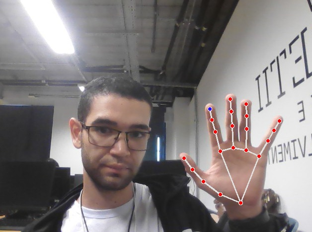
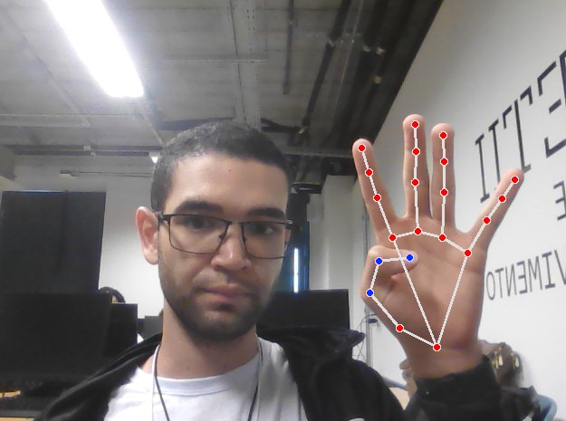
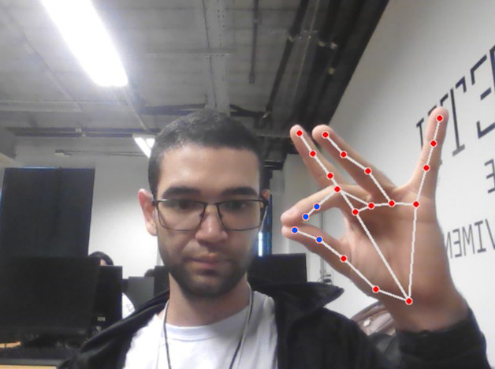
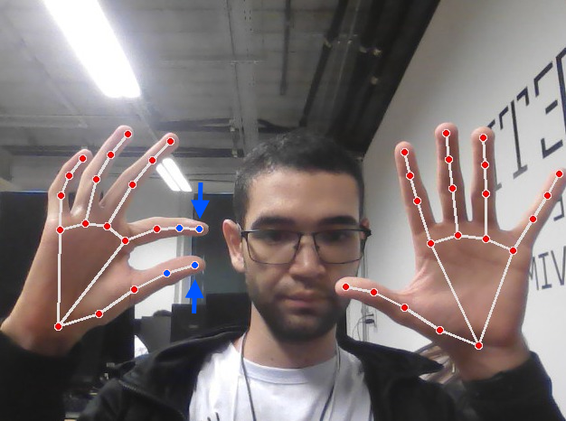

# Controle de Mouse com Hand Tracking

Este projeto utiliza OpenCV, Mediapipe e PyAutoGUI para controlar o mouse e o scroll do computador através de gestos com as mãos. Ele detecta as mãos usando a câmera e interpreta os gestos da mão direita para mover o mouse e clicar, e da mão esquerda para realizar scroll na tela.

## Instalação

1. Clone o repositório:
    ```bash
    git clone https://github.com/MatheusV2021/Captacao-de-Movimento
    ```
2. Crie um ambiente virtual (opcional, mas recomendado):
    ```bash
    python -m venv venv
    ```
3. Ative o ambiente virtual:
    - No Windows:
      ```bash
      venv\Scripts\activate
      ```
    - No macOS/Linux:
      ```bash
      source venv/bin/activate
      ```
4. Instale as dependências:
    ```bash
    pip install opencv-python mediapipe pyautogui
    ```

## Uso

Para executar o projeto, certifique-se de que sua câmera esteja conectada e funcione corretamente. Em seguida, rode o script:

```bash
python Captação de Movimento.py
```

## Comandos

### Mão Direita:
- **Movimento do mouse**: O dedo indicador da mão direita controla o movimento do cursor. Mova o indicador para direcionar o mouse na tela.
- 
  
- **Clicar e segurar**: Aproximar o polegar da base da mão direita aciona o comando de "clique e segurar", simulando um clique contínuo.
- - 

- **Clique único**: Tocar o polegar com o dedo médio da mão direita resulta em um clique único do mouse.
- - 

### Mão Esquerda:
- **Zoom in**: Aproxime o dedo indicador do polegar para dar zoom in.
- - - 

- **Zoom out**: Afaste o dedo indicador do polegar para dar zoom out.
- - - 


Esses comandos permitem controlar o mouse e realizar ações de zoom de forma intuitiva usando gestos com as mãos.

